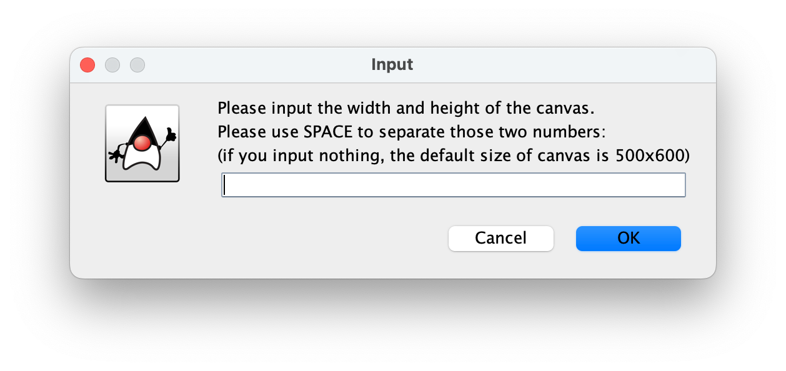
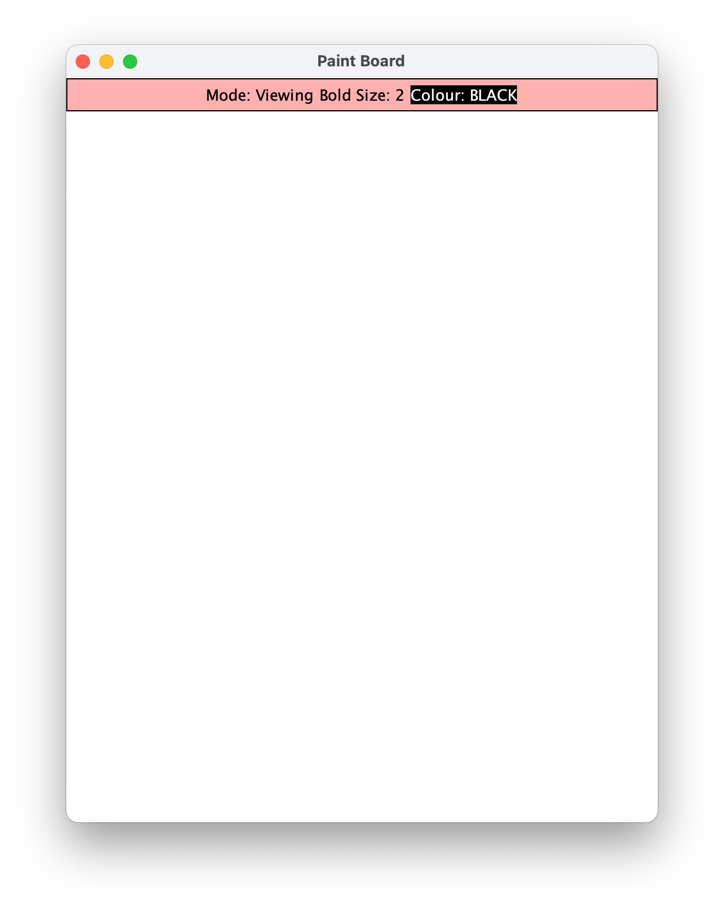
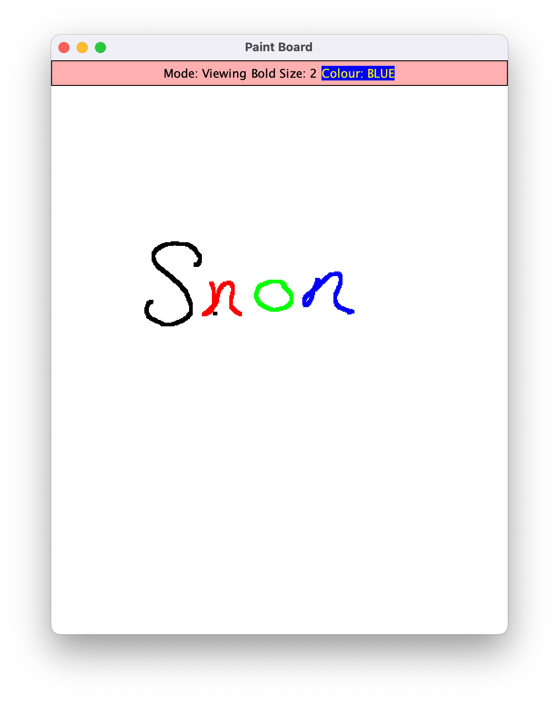
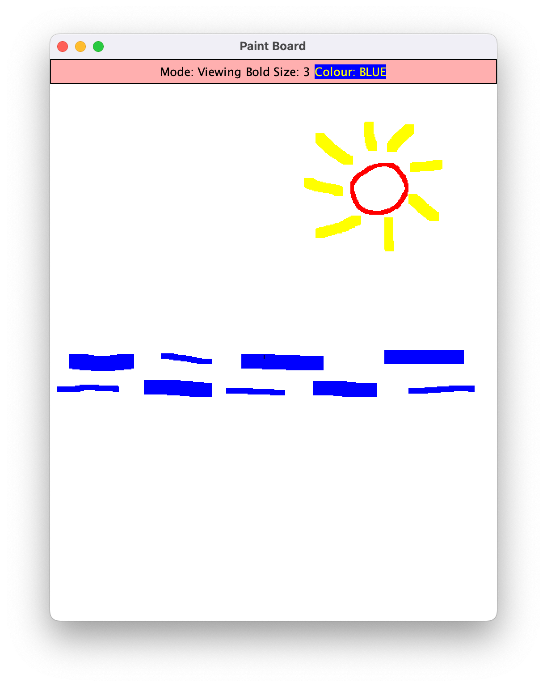

# Paint Board

## description

**paint board** is a simple whiteboard application written in java. unlike most painting programs, you don’t need to press down on the touchpad to draw. instead, you can control the drawing functions using keyboard shortcuts, making it more convenient and comfortable to use.

## features

- **hands-free drawing** – no need to hold down the touchpad
- **keyboard controls** – perform all actions with simple key presses
- **customizable canvas size** – choose your preferred dimensions or use the default size (500x600)
- **undo & redo** – easily fix mistakes
- **color selection** – change colors quickly
- **adjustable brush size** – modify pen thickness as needed
- **canvas clearing** – reset the board instantly
- **save as png** – export your artwork as a local image file

## how to use

### 1. run the application
when you start the program, you'll be prompted to choose the canvas size.
- enter your preferred dimensions or press **enter** to use the default (500x600).

  

### 2. start drawing
- **press 'w'** to start drawing
- **press 'q'** to stop drawing

you don’t need to press the touchpad—just move your finger as if you're drawing on a touchscreen.

  

### 3. editing your drawing
- **undo (press 'u')** – removes the last stroke
- **redo (press 'r')** – restores the last undone stroke
- **change colors (press 'c')** – switch between different colors

  

### 4. adjusting brush size
- **increase size ('=')** – make the brush larger
- **decrease size ('-')** – make the brush smaller

  

### 5. clearing the canvas
- **press '~'** to clear the entire board

### 6. saving your work
- **press '|'** to save your drawing as a png file  